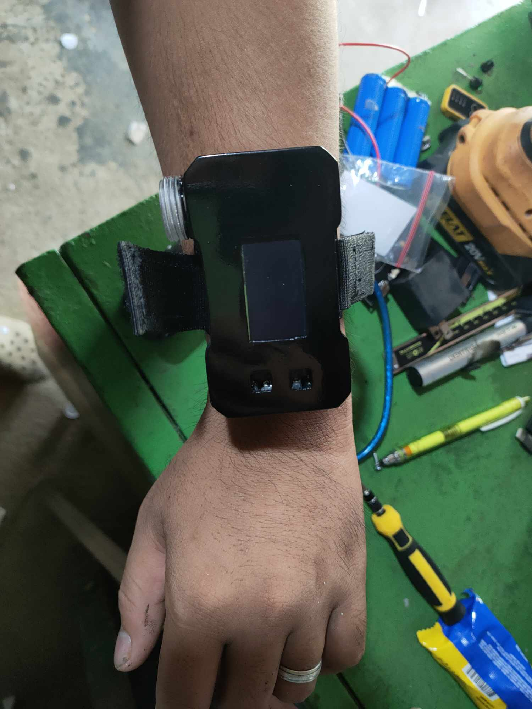
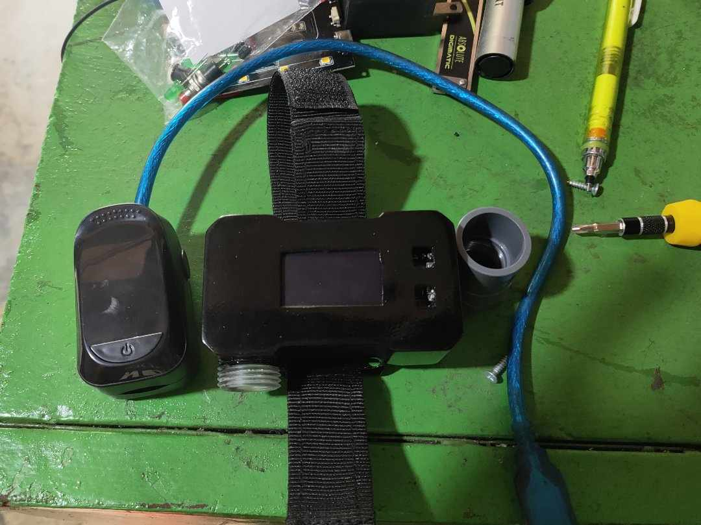
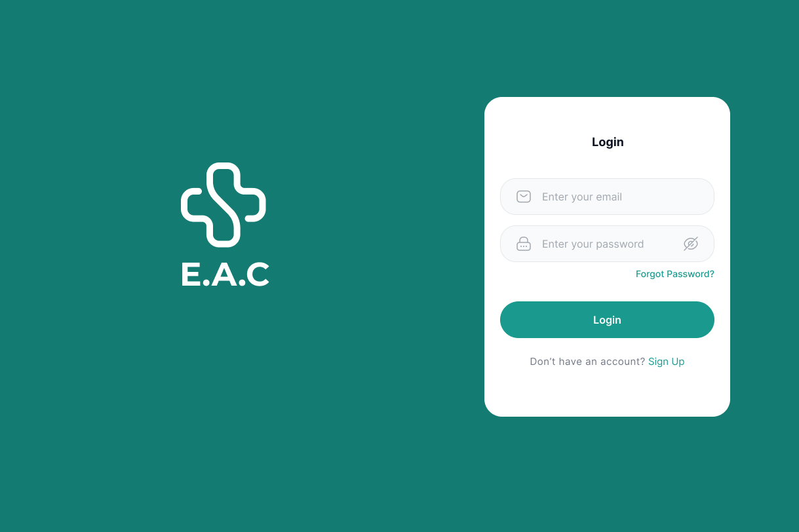
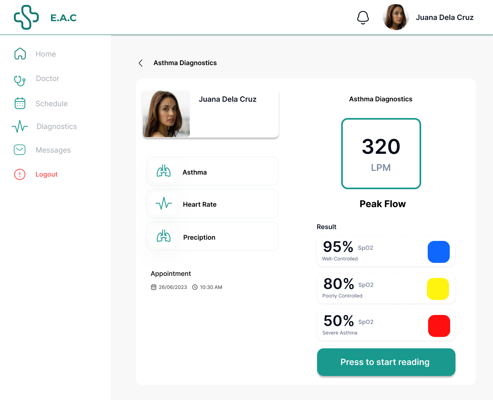
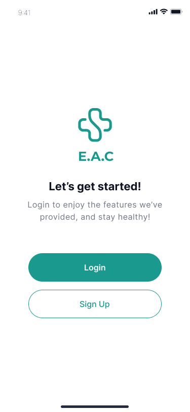
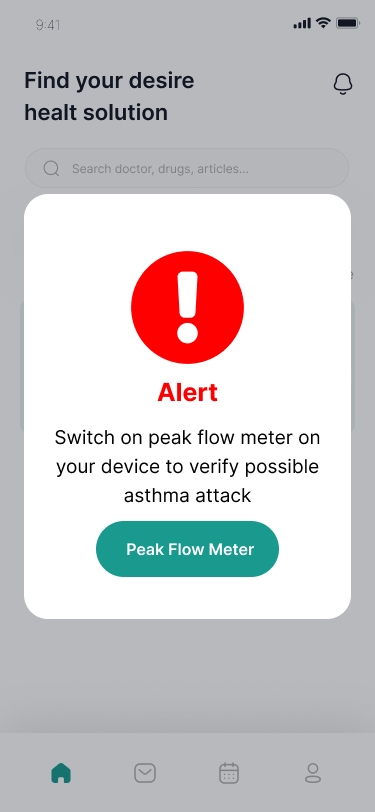

# Enhancing Asthma Care Monitoring System

This project is an IoT-based healthcare system designed to assist in monitoring asthma conditions using real-time physiological data. It integrates an ESP32 device, cloud database (Firebase), a web platform, a Flutter mobile application, and an AI-powered prediction system to provide intelligent health insights.

The system measures **heart rate (BPM)**, **oxygen saturation (SpO2)**, and **peak flow rate**, then sends the data to a server where an AI model analyzes the condition and returns predictions. Both web and mobile platforms allow real-time monitoring, communication, and patient management.

---

## Project Overview

The system consists of five main components:

1. **ESP32 Device (Embedded System)**
2. **Firebase Realtime Database (Cloud Storage)**
3. **AI Server (Flask + Machine Learning)**
4. **Web Application (Doctor + Admin Platform)**
5. **Flutter Mobile App (Patient Application)**

It is designed to:
- monitor vital signs in real time  
- assist asthma patients in tracking breathing conditions  
- provide intelligent predictions using AI  
- enable doctor-patient interaction  
- support mobile and web-based monitoring  
- store and visualize health data remotely  

---

## Features

### 🫀 Real-Time Health Monitoring
- Measures:
  - Heart Rate (BPM)
  - Oxygen Saturation (SpO2)
- Uses **MAX30102 sensor**

---

### 🌬️ Peak Flow Measurement
- Uses a **flow meter sensor**
- Calculates airflow using interrupt-based pulse detection
- Displays peak flow in **L/min**

---

### 📡 Cloud Integration (Firebase)
- Stores real-time readings:
  - BPM
  - SpO2
  - Peak flow
- Uses device UID for structured data storage
- Enables synchronization across device, AI, web, and mobile

---

### 🤖 AI-Based Prediction
- Sends data to a Flask API server
- Uses **Decision Tree Classifier**
- Evaluates condition based on:
  - time (hour, minute)
  - BPM
  - SpO2
- Returns prediction shown on device, web, and mobile

---

### 📺 OLED Display Interface
- Displays:
  - BPM and SpO2 readings
  - Peak flow results
  - AI prediction feedback
- Uses SH1106 OLED (I2C)

---

### 🌐 WiFi Connectivity
- Connects ESP32 to internet
- Enables real-time synchronization

---

## 🌍 Web Application Features (Doctor Platform)

### 📊 Real-Time Patient Dashboard
- Displays live patient data (BPM, SpO2, Peak Flow)
- Shows historical trends and AI predictions

---

### 📞 Video Call System
- Real-time doctor-patient consultation  
- Uses token-based communication (Agora)  

---

### 💬 Chat System
- Real-time messaging between doctor and patient  

---

### 📅 Appointment System
- Schedule and manage consultations  
- View appointment history  

---

### 🧾 Patient Data Management
- Stores patient readings and history  
- Integrated with AI results  

---

## 📱 Flutter Mobile App (Patient Application)

The system includes a dedicated **Flutter mobile application** for patients.

### 📊 Real-Time Monitoring
- View live:
  - BPM
  - SpO2
  - Peak flow readings  

---

### 📈 Health History
- Displays historical data  
- Allows patients to track progress over time  

---

### 🔔 Notifications
- Receives alerts based on AI predictions or abnormal readings  

---

### 💬 Chat with Doctor
- Communicate directly with healthcare providers  

---

### 📞 Join Video Consultation
- Join scheduled video calls from the app  

---

### 📅 Appointment Management
- Book and manage doctor appointments  
- View schedules and reminders  

---

### 📡 Firebase Sync
- Real-time data sync between:
  - ESP32 device  
  - Mobile app  
  - Web system  

---

## System Workflow

### 1. Device Startup
- Connects to WiFi  
- Initializes sensors and OLED  
- Authenticates with Firebase  

---

### 2. Monitoring Mode
- Reads:
  - Heart rate
  - SpO2  
- Displays on device  
- Sends data to Firebase  

---

### 3. AI Prediction
- Sends data to Flask API:  POST /predict
- AI processes data  
- Returns prediction  
- Displayed on device, web, and mobile  

---

### 4. Peak Flow Mode
- Triggered via Firebase flag (`onPF`)  
- User performs blowing action  
- Flow meter detects airflow  
- Calculates peak flow rate  
- Saves to Firebase  

---

### 5. Remote Monitoring
- Doctors use web platform  
- Patients use mobile app  
- Both access real-time and historical data  

---

## Hardware Components

- ESP32  
- MAX30102 (Heart Rate + SpO2 Sensor)  
- Flow Meter Sensor  
- SH1106 OLED Display (I2C)  
- WiFi Network  

---

## Wiring Connections

### 🔌 ESP32 Pin Configuration

| Component            | ESP32 Pin        |
|---------------------|-----------------|
| Flow Meter Signal   | GPIO 19         |
| MAX30102 (SDA)      | GPIO 21 (SDA)   |
| MAX30102 (SCL)      | GPIO 22 (SCL)   |
| OLED (SDA)          | GPIO 21 (SDA)   |
| OLED (SCL)          | GPIO 22 (SCL)   |
| MAX30102 VCC        | 3.3V            |
| MAX30102 GND        | GND             |
| OLED VCC            | 3.3V or 5V      |
| OLED GND            | GND             |

---

### 📟 I2C Devices (Shared Bus)

- SDA → GPIO 21  
- SCL → GPIO 22  

---

### 🌬️ Flow Meter

- Signal → GPIO 19  
- VCC → 5V or 3.3V  
- GND → GND  

---

## Software Components

### Embedded (ESP32)
- Arduino Framework  
- Firebase ESP Client  
- HTTPClient  
- Chrono  

---

### AI Server (Flask)
- Flask API  
- Scikit-learn (Decision Tree Classifier)  
- Firebase Sync  
- Joblib  

---

### Web Application
- Dashboard (real-time monitoring)  
- Video call (Agora)  
- Chat system  
- Appointment system  

---

### Mobile Application (Flutter)
- Real-time health monitoring  
- Chat and video call  
- Appointment management  
- Notifications  

---

## API Endpoints

### `/predict`
- Accepts:
- timestamp
- BPM
- SpO2  
- Returns:
- prediction result  

---

### `/token`
- Generates token for video calls  

---

## Notes

- Uses interrupt-based flow measurement  
- AI model dynamically trains from Firebase data  
- Multi-platform system (Device + Web + Mobile)  

---

## Limitations

- Requires stable internet connection  
- AI accuracy depends on dataset  
- No offline mode  

---

## Summary

This project demonstrates a complete **IoT healthcare ecosystem** that combines:

- embedded systems (ESP32)  
- biomedical sensing  
- cloud database (Firebase)  
- AI prediction (Machine Learning)  
- web-based telehealth platform  
- Flutter mobile application  

It is suitable for:
- asthma monitoring  
- remote patient care  
- telemedicine systems  
- smart healthcare solutions

## Images/Screenshots

